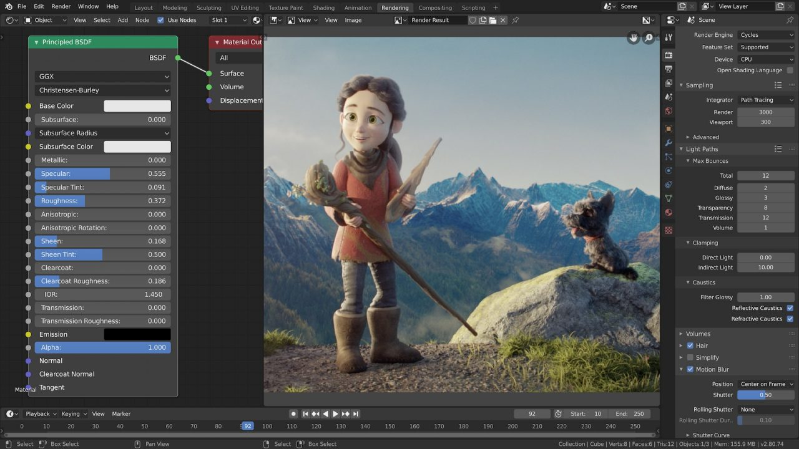

# Blender

A free and open-source 3D creation suite. It supports the entirety of the 3D pipeline—modeling, rigging, animation, simulation, rendering, compositing and motion tracking, video editing and 2D animation pipeline.

Read more about it at: https://www.blender.org/